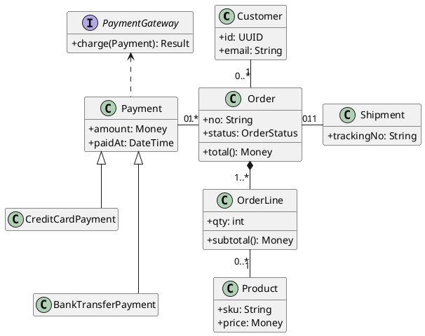

# 專業 UML 繪製（版面優先）

UML 畫得不專業，九成不是符號用錯，而是**版面**：線交叉成一團、元素擺放沒有邏輯、圖長成一條 3000px 的細長條，讀者滑三次螢幕還拼不出全貌。

這個 skill 的核心主張是：**版面是資訊，不是美感**。誰在上面、誰在旁邊、線往哪走，都在告訴讀者這個系統怎麼組織。所以版面不能交給工具隨便排，要刻意設計。

## 動筆前先確定四件事

缺哪一項就**直接問**，或提出你的假設請對方確認——不要默默猜。

1. **哪一種 UML 圖**。使用者常說「畫個圖」，但類別圖（結構）跟循序圖（互動）回答的是完全不同的問題。不確定就依他想回答的問題選：「有哪些東西、怎麼關聯」→ 類別圖；「這件事怎麼發生的、誰先誰後」→ 循序圖；「這個東西有哪些狀態」→ 狀態圖。
2. **給誰看**。主管版跟工程師版的元素數量差三倍。
3. **範圍邊界**。哪些屬於這張圖，哪些是別張圖的事。講不清楚就會愈畫愈大，而圖一大，版面就必爛。
4. **元素上限**。類別圖 12–15 個、循序圖 5–7 條生命線、狀態圖 8–12 個狀態。**超過就拆圖，不要硬塞**——這是保住版面最有效的一招，其他技巧都排在它後面。

## 工具選擇：預設 PlantUML

| | PlantUML | Mermaid |
|---|---|---|
| 版面控制 | 方向箭頭、隱形線、`together`、間距參數 | 幾乎只有 `direction`，其餘交給演算法 |
| UML 完整度 | 九種圖全支援 | 類別／循序／狀態／ER，細節缺較多 |
| 貼上就能看 | 需渲染器或 plantuml.com | GitHub、Notion、HackMD 原生支援 |

**只要使用者在意版面（線不交叉、要正方形、要緊湊），就用 PlantUML。** Mermaid 沒有給你調整的手把，你只能祈禱。只有在對方明說要貼進 GitHub/Notion、或圖很簡單（5 個元素以內）時才用 Mermaid。

## 版面三原則

使用者要的三件事——邏輯順序、線不交叉、緊湊且接近正方形——彼此會打架。**優先順序是：邏輯順序 > 不交叉 > 緊湊。** 為了塞得更小而把父類別放到子類別下面，是本末倒置。

### 一、邏輯順序：方向本身有語意

同一份文件裡方向語意必須一致，讀者才能不讀文字就先讀懂結構。

| 關係 | 方向 | 為什麼 |
|---|---|---|
| 繼承／實作 | 父類別在**上**，子類別在下 | 抽象在上、具體在下是普世讀法 |
| 組合／聚合 | 整體在**上**，部分在下 | 由整體往細節展開 |
| 依賴／關聯 | **水平**擺放 | 跟垂直的階層線區隔，一眼分得出來 |
| 循序圖生命線 | 由**左至右**：使用者 → 介面 → 控制 → 資料 → 外部系統 | 呼叫大多往右流，回頭線最少 |
| 狀態圖 | 初始狀態左上，終止狀態右下 | 時間感由左上往右下 |

**先畫骨架，再掛關聯。** 繼承與組合這類階層關係決定了整張圖的層次結構，關聯線只能在既定層次上繞。所以順序是：先把階層排好、渲染確認、再加關聯線。反過來做一定要重排。

### 二、減少交叉線——但**線絕對不能重疊**

先講優先順序：**重疊比交叉嚴重**。交叉只是一個點，讀者仍看得出是兩條線各走各的；
重疊是一整段，兩條不相干的線直接變成同一條，讀者根本不知道那裡有幾條線。
所以在「多一個交叉點」與「兩條線並行一段」之間，永遠選前者。

不共用走廊、不做共用匯流排：**一條線一條專屬線道**。唯一容許的重疊是共用端點的線
在那個端點旁邊的短樁（從同一個錨點出發，本來就得先重合一小段才分得開）。
線道怎麼排才不會交叉，見 `references/layout-toolbox.md`「線道的排序決定會不會交叉」。

以下是把交叉降下來的手法：

1. **宣告順序影響左右排列**。同一層的元素，PlantUML 大致依宣告先後由左至右擺（不是絕對，演算法還會再調）。**把有連線的元素宣告在一起**，交叉會少很多。
2. **連線超過四條的元素移到中央**，讓線往四個方向散出去，不要擠在同一側。
3. **回頭線最容易造成交叉**（下層指回上層的關聯）。用 `-up->` 明確指定方向，或改成 `note` 說明。
4. **交叉修不掉就是圖太大了**。回頭拆圖，比繼續調參數有效。

### 三、緊湊且接近正方形

目標：**長寬比（寬/高）落在 0.75–1.35**。超出就要動手。

先估算：元素 n 個，理想是排成約 √n × √n 的網格。12 個類別 → 3–4 排，每排 3–4 個。數一下最長的鏈有幾層、最寬的一層有幾個，心裡先有底。

以下是實測數據（同一張 9 元素類別圖，各種手法的長寬比與面積）：

| 手法 | 長寬比 | 面積 | 評價 |
|---|---|---|---|
| 什麼都不做 | 1.53 | 408k | 基準 |
| 只調間距 `nodesep`/`ranksep` | 1.68 | 327k | 縮面積有效，**比例反而更歪** |
| `left to right direction` | 2.65 | 207k | 面積最小但**壓成細長條** |
| 方向箭頭亂折 | 2.18 | 242k | 折錯方向會更糟 |
| `-[hidden]-` 堆疊兄弟節點 | 1.50 | 241k | 面積 −41%，比例持平 |
| **堆疊＋側枝＋主幹保持垂直** | **1.36** | 265k | **最佳** |

三個可以直接用的結論：

- **`-[hidden]down-` 把並排的兄弟節點改成上下堆疊，是拉正比例最有效的手法。** 圖太寬時，找出最寬那一排，把其中兩個元素用隱形線串成上下關係。
- **`left to right direction` 只適合原本就太高的圖。** 對已經偏寬的圖使用，只會更扁。改完一定要重新渲染確認。
- **主幹保持垂直，只把分支往側邊拉。** 主幹跟著折會讓讀者找不到主線。

循序圖另有一招，效果比上面全部都大：

```
skinparam maxMessageSize 110
```

訊息文字過長會把生命線推得很開。實測一張 5 條生命線的循序圖，**長寬比從 2.64 降到 1.14、面積 −15%**，只加這一行。循序圖偏寬時先加這個，再考慮其他事。

### 四、線要接得乾淨（座標型工具才控制得到）

前三個原則決定東西擺哪裡，這一條決定線長什麼樣。PlantUML 沒有這個手把（只能用
`skinparam linetype ortho`），但在 draw.io 這類自己指定座標的工具裡，它是「圖看起來
專不專業」最直接的差別：

1. **每條線的起訖點都要固定在某一條邊上**，預設用該邊的中點：`(0.5,0)` 上、
   `(1,0.5)` 右、`(0.5,1)` 下、`(0,0.5)` 左。矩形的這四點是**邊界中點**，菱形的是
   **四個頂點**——菱形內接於它的方框，所以同一組數值同時滿足兩種形狀。
   沒指定就是浮動連接點，mxGraph 每次算出來的落點都不同、會偏離邊界中點，
   看起來就是「線沒接在框上」。
1b. **同一個節點同一側接了多條線時，沿那條邊把錨點分開**（k 條 → `1/(k+1)`、
   `2/(k+1)`…）。共用同一個錨點的話，那幾條線會從同一點以同一個方向出發，
   在分岔之前完全重合——**一個欄位連到兩個地方，讀者必須看得出來是兩條線**。
   分配順序依「對面那一端的位置」排，線在節點旁邊才不會自己先交叉。
   （`drawio_gen.assign_anchors()` 會自動處理。）
1c. **但這只對矩形成立。** 菱形（判斷）與橢圓（起訖）只有四個中點真的落在形狀上，
   把錨點挪到 `(0.33, 0)` 就會落在框線外的空白處，**箭頭浮在半空、看起來沒接到東西**。
   所以這兩種形狀的同一個頂點只能接一條線；多出來的要**改接別的頂點**，
   而不是把錨點推開。菱形一共只有四個接點，通常是「上進、下出、左右各一條分支」，
   迴圈回來的線要自己找剩下的那一個頂點，找不到就得繞遠路從另一側進來。
   四個以上的分支就是超過形狀的容納量，那時要嘛改結構，要嘛明講這是已知例外。
2. **繞線點必須與它相鄰的錨點共線**（共用 x 或 y）。不共線的話工具會在形狀旁邊
   補一小段折線把兩者接起來，那個小勾就是「線有間隙／沒對準」的真正來源。
3. **全程正交**：每一段不是水平就是垂直，沒有斜線段。
4. **座標對齊格線**：節點的 x/y/寬/高都用 10 的倍數，寬高再進一步用 **20 的倍數**——
   中心 = x + 寬/2，寬是 20 的倍數時中心才會落在格線上，同一欄不同寬度的節點
   錨點才會對齊在同一條垂直線上，垂直主幹才會是一條直線而不是一串小階梯。

在這個專案裡這四點是自動的：`drawio_gen.build()` 會替每條邊算出並寫入
`exitX/exitY/entryX/entryY`，`drawio_gen.align_waypoints()` 把繞線點推到錨點的軸上，
`check_kinks()` 驗證沒有小勾，`scripts/check_layout.py` 再從檔案端複驗一次。

## 排版工具箱

按實測效果排序，由上往下試：

```
' 1. 堆疊：把並排的兄弟改成上下（拉正比例最有效）
A -[hidden]down- B

' 2. 方向指定：主幹垂直，分支往側邊
Order -down-> OrderLine
Order -left-> Payment

' 3. 循序圖專用：限制訊息文字寬度
skinparam maxMessageSize 110
skinparam ParticipantPadding 8

' 4. 間距壓縮（縮面積用，對比例幫助不大）
skinparam nodesep 40
skinparam ranksep 45

' 5. 減少方框體積
hide empty members
skinparam classAttributeIconSize 0
```

`together { }` 實測幾乎無效（1.51 vs 1.50），別依賴它。

`skinparam linetype ortho`（直角線）**不改變尺寸，只改變線的走法**。多條線平行時比較好讀，但配上太小的 `nodesep` 會讓多重性標籤壓在方框上。要用就把 `nodesep` 開到 40 以上。

**注意：水平關聯線上的兩個多重性標籤容易擠在一起**（`0..*` 和 `1` 黏成 `0..*1`）。帶多重性的關聯盡量走垂直，或把 `nodesep` 加大。

## 收斂流程

版面不可能一次寫對——**我在準備這個 skill 時第一次折疊就把比例從 1.53 折壞成 2.18**。所以流程是量出來的，不是想出來的：

1. 先寫骨架（只有階層關係），渲染。
2. 加上關聯線，渲染。
3. **量長寬比**：`python scripts/check_layout.py diagram.puml`
4. 依腳本建議調整 → 重新渲染 → 再量。
5. **打開圖用眼睛看**：標籤有沒有壓到方框、線有沒有穿過方框、主幹是不是一眼看得出來。這一步不能省，數字漂亮不代表圖好看。

沒有渲染環境時（沒有 java 或 plantuml.jar），就把版面決策當成假設明講出來，並提醒使用者貼到 <https://www.plantuml.com/plantuml> 或 <https://kroki.io> 確認，不要假裝已經驗過。

## 交付前檢查清單

1. 長寬比在 0.75–1.35 之間，或已說明為什麼做不到。
2. 繼承／組合方向一致：父在上、整體在上。
3. 沒有可以靠重排消掉的交叉線。
4. 多重性標籤沒有壓在方框或彼此重疊上。
5. 沒有孤立元素——每個元素至少有一條線連著，否則它為什麼在這張圖。
6. 元素數在該圖型的上限內。
7. 命名一致：類別 `PascalCase`、方法與屬性 `camelCase`、不要中英混用同一層級。
8. 語法能實際渲染過。
9. （座標型工具）每條線的起訖點都在邊界中點／菱形頂點，繞線點與錨點共線，
   全程正交，節點座標對齊格線——`check_layout.py` 的「接點／歪接／格線」三欄要全是 0。
10. **沒有共線重疊的線**（`check_layout.py` 的「線重疊」必須是 0，這條沒有例外）。
    交叉數則是越少越好，消不掉的要說明為什麼。

## 完整範例

使用者說：「幫我畫電商訂單的類別圖。」



這張圖做了什麼：主幹（Customer → Order → OrderLine → Product）保持一條垂直線，讀者一眼看到主線；付款與出貨兩個分支往左右拉開，不增加高度；兩個付款子類別本來會並排把圖撐寬，用隱形線疊成上下。實測 **639×456、長寬比 1.40**，比不做任何處理的 791×516 面積少 29%，而且零交叉線。

**注意這裡停在 1.40，略高於 1.35 的目標。** 把 `nodesep` 壓到 20 可以做到 1.36，但多重性標籤會壓在方框上。比例是為了讓圖好讀，讀不了的圖比例再漂亮也沒用——這就是「邏輯順序 > 不交叉 > 緊湊」的實際含義。差一點點時，**說明原因比硬湊數字誠實**。

搭配輸出的說明要包含：**你替使用者補了哪些假設**（例如「假設一張訂單可以分次付款」）、**刻意省略了什麼**（例如「庫存與退貨另外畫」）、**建議追問的缺口**。

## 延伸參考

- 各圖型的擺放規則與語意約定（循序圖、狀態圖、使用案例圖、元件圖、活動圖、ER 圖）→ `references/diagram-types.md`
- 完整的版面參數、方向控制細節、Mermaid 對照 → `references/layout-toolbox.md`
- 語法與渲染地雷（中文、跳脫字元、ortho 崩壞、常見錯誤訊息）→ `references/pitfalls.md`
- 渲染並量測長寬比 → `scripts/check_layout.py`

## 這個專案的既有圖表（.drawio）

本專案 `rule_doc/功能需求/diagrams/` 下的圖不是 PlantUML，而是由 `drawio-flowchart`
skill 的 `drawio_gen.py` 產生的 draw.io 檔。要畫**新的**圖，仍走 `drawio-flowchart`
（它管節點語彙、命名、檔案位置與結構驗證）；這個 skill 管的是**版面品質**，兩者疊加使用：

- `drawio_gen.check_overlaps()` 檢查「線有沒有壓到方框文字」（結構正確性）。
- `scripts/check_layout.py` 檢查「長寬比、線的交叉數、方向語意」（版面品質）。

`scripts/check_layout.py` 直接吃 `.drawio` 檔，不需要 java 或 plantuml.jar：

```bash
python3 .claude/skills/uml-diagram/scripts/check_layout.py rule_doc/功能需求/diagrams/*.drawio
```

在 draw.io 裡座標是你自己指定的，上面「三原則」照樣適用，只是手法換成座標：

- **邏輯順序** → 主幹固定在同一個 x（垂直脊椎），錯誤／側枝一律往右，回收線往左。
- **不交叉** → 側枝與主幹之間留一條淨空的走廊 x，回頭線走圖形外側的左側走廊。
- **緊湊接近正方形** → 流程太長時折成**兩欄蛇形**（第一欄往下、跨到第二欄再往下），
  這就是 `-[hidden]down-` 堆疊在 draw.io 的等價手法，是把細長流程圖拉回 0.75–1.35 最有效的一招。
